Robust FPCA for sparsely observed curves
================
Matias Salibian-Barrera & Graciela Boente
2020-10-30

This repository contains the `sparseFPCA` package that implements the
robust FPCA method introduced in [Boente and
Salibian-Barrera, 2020](https://github.com/msalibian/sparseFPCA).

**LICENSE**: The content in this repository is released under the
“Creative Commons Attribution-ShareAlike 4.0 International” license.
See the **human-readable version**
[here](https://creativecommons.org/licenses/by-sa/4.0/) and the **real
thing**
[here](https://creativecommons.org/licenses/by-sa/4.0/legalcode).

## sparseFPCA - Robust FPCA for sparsely observed curves

The `sparseFPCA` package implements the robust functional principal
components analysis (FPCA) estimator introduced in [Boente and
Salibian-Barrera, 2020](https://github.com/msalibian/sparseFPCA).
`sparseFPCA` computes robust estimators for the mean and covariance
(scatter) functions, and the corresponding eigenfunctions. It can be
used with functional data sets where only a few observations per curve
are available (possibly recorded at irregular intervals).

#### Installing the `sparseFPCA` package for `R`

The package can be installed directly from this repository using the
following command in `R`:

``` r
devtools::install_github('msalibian/sparseFPCA', ref = "master")
```

## An example - CD4 counts data

Here we illustrate the use of our method and compare it with existing
alternatives. We will analyze the CD4 data, which is available in the
`catdata` package
([catdata](https://cran.r-project.org/package=catdata)). These data are
part of the Multicentre AIDS Cohort Study ([Zeger and
Diggle, 1994](https://doi.org/10.2307/2532783)). They consist of 2376
measurements of CD4 cell counts, taken on 369 men. The times are
measured in years since seroconversion (`t = 0`).

We first load the data set and arrange it in a suitable format. Because
the data consist of trajectories of different lengths, possibly measured
at different times, the software requires that the observations be
arranged in two lists, one (which we call `X$x` below) containing the
vectors (of varying lengths) of points observed in each curve, and the
other (`X$pp`) with the corresponding times:

``` r
data(aids, package='catdata')
X <- vector('list', 2) 
names(X) <- c('x', 'pp')
X$x <- split(aids$cd4, aids$person)
X$pp <- split(aids$time, aids$person)
```

To ensure that there are enough observations to estimate the covariance
function at every pair of times `(s, t)`, we only consider observations
for which `t >= 0`, and remove individuals that only have one
measurement.

``` r
n <- length(X$x)
shorts <- vector('logical', n)
for(i in 1:n) {
  tmp <- (X$pp[[i]] >= 0)
  X$pp[[i]] <- (X$pp[[i]])[tmp]
  X$x[[i]] <- (X$x[[i]])[tmp]
  if( length(X$pp[[i]]) <= 1 ) shorts[i] <- TRUE
}
X$x <- X$x[!shorts]
X$pp <- X$pp[!shorts]
```

This results in a data set with `N = 292` curves, where the number of
observations per individual ranges between 2 and 11 (with a median of
5):

``` r
length(X$x)
```

    ## [1] 292

``` r
summary(lens <- sapply(X$x, length))
```

    ##    Min. 1st Qu.  Median    Mean 3rd Qu.    Max. 
    ##   2.000   3.000   5.000   4.983   6.000  11.000

``` r
table(lens)
```

    ## lens
    ##  2  3  4  5  6  7  8  9 10 11 
    ## 51 52 35 43 39 20 23 10 15  4

The following figure shows the data set with three randomly chosen
trajectories highlighted with solid black lines:

``` r
xmi <- min( tmp <- unlist(X$x) )
xma <- max( tmp )
ymi <- min( tmp <- unlist(X$pp) )
yma <- max( tmp ) 
n <- length(X$x)
plot(seq(ymi, yma, length=5), seq(xmi, xma,length=5), type='n', xlab='t', ylab='X(t)')
for(i in 1:n) { lines(X$pp[[i]], X$x[[i]], col='gray', lwd=1, type='b', pch=19, 
                     cex=1) }
lens <- sapply(X$x, length)
set.seed(22)
ii <- c(sample((1:n)[lens==2], 1), sample((1:n)[lens==5], 1), 
        sample((1:n)[lens==10], 1))
for(i in ii) lines(X$pp[[i]], X$x[[i]], col='black', lwd=4, type='b', pch=19, 
                   cex=1, lty=1)
```

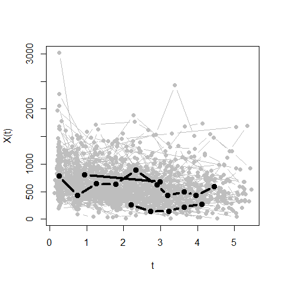<!-- -->

### Robust and non-robust FPCA

We will compare the robust and non-robust versions of our approach with
the PACE estimator of Yao, Muller and Wang
([paper](https://doi.org/10.1198/016214504000001745) -
[package](https://cran.r-project.org/package=fdapace)). We need to load
the following packages

``` r
library(sparseFPCA)
library(doParallel)
library(fdapace)
```

The specific versions of these packages that were used here (via the
output of the function `sessionInfo()`) can be found at the bottom of
this page.

The following are parameters required for our estimator.

``` r
ncpus <- 4
seed <- 123
rho.param <- 1e-3 
max.kappa <- 1e3
ncov <- 50
k.cv <- 10
k <- 5
s <- k 
hs.mu <- seq(.1, 1.5, by=.1)
hs.cov <- seq(1, 7, length=10)
```

We now fit the robust and non-robust versions of our proposal, and also
the PACE estimator. This step may take several minutes to run:

``` r
ours.ls <- lsfpca(X=X, ncpus=ncpus, hs.mu=hs.mu, hs.cov=hs.cov, rho.param=rho.param, 
                  k = k, s = k, trace=FALSE, seed=seed, k.cv=k.cv, ncov=ncov,
                  max.kappa=max.kappa)
ours.r <- efpca(X=X, ncpus=ncpus, hs.mu=hs.mu, hs.cov=hs.cov, rho.param=rho.param,
                alpha=0.2, k = k, s = k, trace=FALSE, seed=seed, k.cv=k.cv, ncov=ncov,
                max.kappa=max.kappa)
myop <- list(error=FALSE, methodXi='CE', dataType='Sparse', 
             userBwCov = 1.5, userBwMu= .3, kernel='epan', verbose=FALSE, nRegGrid=50)
pace <- FPCA(Ly=X$x, Lt=X$pp, optns=myop)
```

The coverage plot:

``` r
plot(ours.ls$ma$mt[,1], ours.ls$ma$mt[,2], pch=19, col='gray70', cex=.8, 
     xlab='s', ylab='t', cex.lab=1.2, cex.axis=1.1)
points(ours.ls$ma$mt[,1], ours.ls$ma$mt[,1], pch=19, col='gray70', cex=.8)
```

<!-- -->

The estimated covariance functions:

``` r
ss <- tt <- ours.r$ss
G.r <- ours.r$cov.fun
filled.contour(tt, ss, G.r, main='ROB')
ss <- tt <- ours.ls$ss
G.ls <- ours.ls$cov.fun
filled.contour(tt, ss, G.ls, main='LS')
ss <- tt <- pace$workGrid
G.pace <- pace$smoothedCov
filled.contour(tt, ss, G.pace, main='PACE')
```

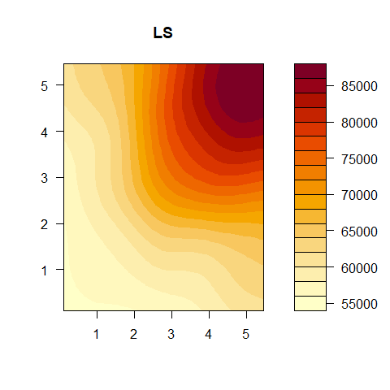

Another take:

``` r
persp(ours.r$tt, ours.r$ss, G.r, xlab="s", ylab="t", zlab=" ",  
      zlim=c(10000, 130000), theta = -30, phi = 30, r = 50, 
      col="gray90", ltheta = 120, shade = 0.15, ticktype="detailed", 
      cex.axis=0.9, main = 'ROB')
persp(ours.ls$tt, ours.ls$ss, G.ls, xlab="s", ylab="t", zlab=" ", 
      zlim=c(10000, 130000), theta = -30, phi = 30, r = 50, 
      col="gray90", ltheta = 120, shade = 0.15, ticktype="detailed", 
      cex.axis=0.9, cex.lab=.9, main = 'LS')
persp(pace$workGrid, pace$workGrid, G.pace, xlab="s", ylab="t", zlab=" ",  
      zlim=c(10000, 130000), theta = -30, phi = 30, r = 50, 
      col="gray90", ltheta = 120, shade = 0.15, ticktype="detailed", 
      cex.axis=0.9, main = 'PACE')
```

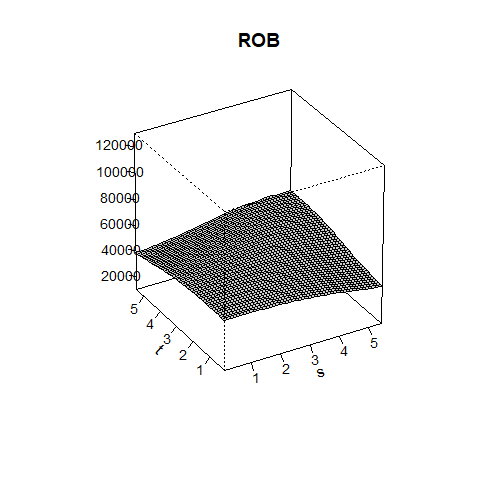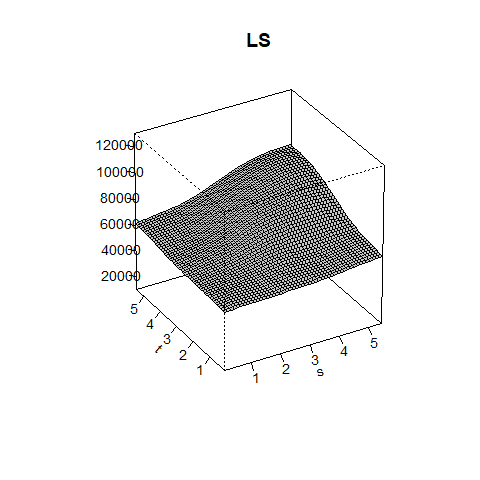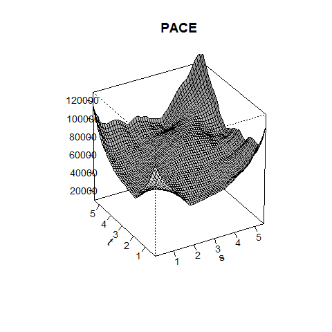

The “proportion of variance” explained by the first few principal
directions are:

``` r
dd <- svd(ours.r$cov.fun)$d
ddls <- svd(ours.ls$cov.fun)$d
ddp <- svd(pace$smoothedCov)$d
rbind(ours = cumsum(dd)[1:3] / sum(dd), 
      ls = cumsum(ddls)[1:3] / sum(ddls), 
      pace = cumsum(ddp)[1:3] / sum(ddp))
```

    ##           [,1]      [,2]      [,3]
    ## ours 0.9887100 0.9992138 0.9995593
    ## ls   0.9769791 0.9979702 0.9993578
    ## pace 0.8735757 0.9438932 0.9688466

In what follows we will use 2 principal components. The corresponding
estimated scores are:

``` r
colors <- c('skyblue2', 'tomato3', 'gray70') #ROB, LS, PACE
boxplot(cbind(ours.r$xis[, 1:2], ours.ls$xis[, 1:2], pace$xiEst[, 1:2]), 
        names = rep(1:2, 3), col=rep(colors, each=2))
abline(h=0, lwd=2)
abline(v=c(2.5, 4.5), lwd=2, lty=2)
axis(3, las=1, at=c(1.5,3.5,5.5), cex.axis=1.4, lab=c('ROB', 'LS', 'PACE'),
     line=0.2, pos=NA, col="white")
```

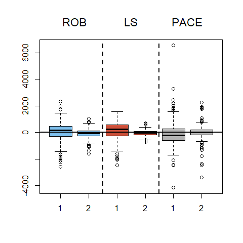<!-- -->

We now compare the first two eigenfunctions.

``` r
G2 <- ours.r$cov.fun
G2.svd <- svd(G2)$u
G.pace <- pace$smoothedCov
Gpace.svd <- svd(G.pace)$u
G2.ls <- ours.ls$cov.fun
G2.ls.svd <- svd(G2.ls)$u
ma <- -(mi <- -0.5) # y-axis limits
for(j in 1:2) {
  phihat <- G2.svd[,j]
  phipace <- Gpace.svd[,j]
  phils <- G2.ls.svd[,j]
  sg  <- as.numeric(sign(phihat  %*% phipace ))
  phipace <- sg * phipace
  sg <- as.numeric(sign(phihat  %*% phils ))
  phils <- sg * phils
  tt <- unique(ours.r$tt)
  tt.ls <- unique(ours.ls$tt)
  tt.pace <- pace$workGrid
  plot(tt, phihat, ylim=c(mi,ma), type='l', lwd=4, lty=1,
       xlab='t', ylab=expression(hat(phi)), cex.lab=1.1, 
       main=paste0('Eigenfunction ', j)) 
  lines(tt.ls, phils, lwd=4, lty=2) 
  lines(tt.pace, phipace, lwd=4, lty=3) 
  legend('topright', legend=c('Robust (ROB)', 'Non-robust (LS)', 
                              'PACE'), lwd=2, lty=1:3)
}
```

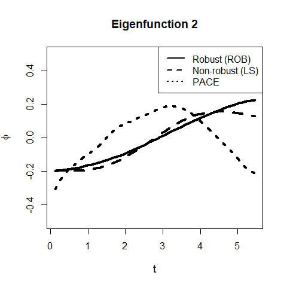

### Potential outliers

We look for potential outliers, using the scores on the first two
eigenfunctions.

``` r
kk <- 2
xis.r  <- ours.r$xis[, 1:kk]
dist.ous <- RobStatTM::covRob(xis.r)$dist 
ous <- (1:length(dist.ous))[ dist.ous > qchisq(.995, df=kk)]
```

We look at the 5 most outlying curves, as flagged by the robust fit:

``` r
xmi <- min( tmp <- unlist(X$x) )
xma <- max( tmp )
ymi <- min( tmp <- unlist(X$pp) )
yma <- max( tmp ) 
ii <- 1:length(X$x)
plot(seq(ymi, yma, length=5), seq(xmi, xma,length=5), type='n', xlab='t', ylab='X(t)')
title(main='Most outlying')
for(i in ii) { lines(X$pp[[i]], X$x[[i]], col='gray', lwd=1, type='b', pch=19, 
                     cex=1.2) }
ii4 <- order(dist.ous, decreasing=TRUE)[1:5]
for(i in ii4) lines(X$pp[[i]], X$x[[i]], col='black', lwd=3, type='b', pch=19, cex=1.2)
```

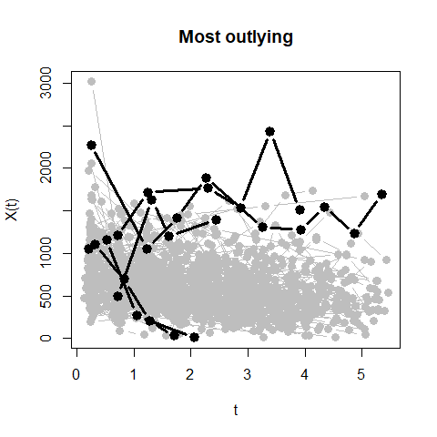<!-- -->

### Comparing fits on “cleaned” data

We now remove the outliers and re-fit the non-robust estimators:

``` r
X.clean <- X
X.clean$x <- X$x[ -ous ]
X.clean$pp <- X$pp[ -ous ]
```

Now re-fit on the “clean” data:

``` r
ours.ls.clean <- lsfpca(X=X.clean, ncpus=ncpus, hs.mu=hs.mu, hs.cov=hs.cov,
                        rho.param=rho.param, k = k, s = k, trace=FALSE, 
                        seed=seed, k.cv=k.cv, ncov=ncov, max.kappa=max.kappa)
myop.clean <- list(error=FALSE, methodXi='CE', dataType='Sparse', 
             userBwCov = 1.5, userBwMu= .3, 
             kernel='epan', verbose=FALSE, nRegGrid=50)
pace.clean <- FPCA(Ly=X.clean$x, Lt=X.clean$pp, optns=myop.clean)
```

The estimated covariance functions:

``` r
ss <- tt <- ours.r$ss
G.r <- ours.r$cov.fun
filled.contour(tt, ss, G.r, main='ROB')
ss <- tt <- ours.ls.clean$ss
G.ls.clean <- ours.ls.clean$cov.fun
filled.contour(tt, ss, G.ls.clean, main='LS - Clean')
ss <- tt <- pace.clean$workGrid
G.pace.clean <- pace.clean$smoothedCov
filled.contour(tt, ss, G.pace.clean, main='PACE - Clean')
```

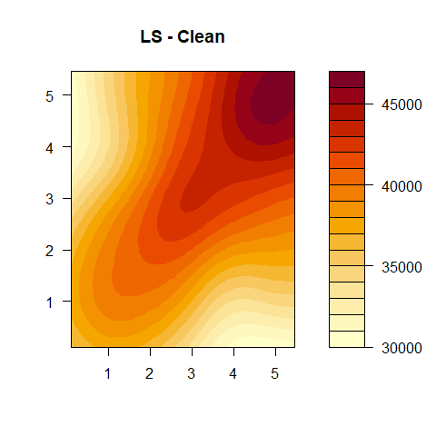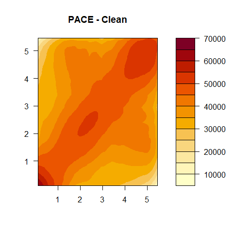

And:

``` r
persp(ours.r$ss, ours.r$ss, G.r, xlab="s", ylab="t", zlab=" ",  
      zlim=c(10000, 65000), theta = -30, phi = 30, r = 50, col="gray90",
      ltheta = 120, shade = 0.15, ticktype="detailed", cex.axis=0.9, main ='ROB')
persp(ours.ls.clean$ss, ours.ls.clean$ss, G.ls.clean, xlab="s", ylab="t", zlab=" ", 
      zlim=c(10000, 65000), theta = -30, phi = 30, r = 50, col="gray90",
      ltheta = 120, shade = 0.15, ticktype="detailed", cex.axis=0.9,
      main = 'LS - Clean')
persp(pace.clean$workGrid, pace.clean$workGrid, G.pace.clean, xlab="s", ylab="t", 
      zlab=" ", zlim=c(10000, 65000), theta = -30, phi = 30, r = 50, 
      col="gray90", ltheta = 120, shade = 0.15, ticktype="detailed", cex.axis=0.9, 
      main = 'PACE - Clean')
```

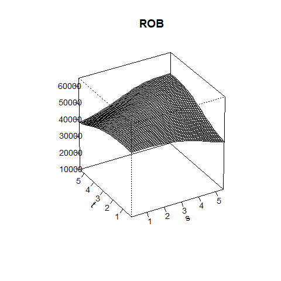

We can also compare the eigenfunctions:

``` r
G2 <- ours.r$cov.fun
G2.svd <- svd(G2)$u
G.pace.clean <- pace.clean$smoothedCov 
Gpace.svd.clean <- svd(G.pace.clean)$u
G2.ls.clean <- ours.ls.clean$cov.fun
G2.ls.svd.clean <- svd(G2.ls.clean)$u
ma <- -(mi <- -0.5)
for(j in 1:2) {
  phihat <- G2.svd[,j]
  phipace <- Gpace.svd.clean[,j] 
  phils <- G2.ls.svd.clean[,j]
  sg <- as.numeric(sign(phihat  %*% phipace ))
  phipace <- sg * phipace
  sg <- as.numeric(sign(phihat  %*% phils ))
  phils <- sg * phils
  tt <- unique(ours.r$tt)
  tt.ls <- unique(ours.ls.clean$tt)
  tt.pace <- pace.clean$workGrid
  plot(tt, phihat, ylim=c(mi,ma), type='l', lwd=4, lty=1,
       xlab='t', ylab=expression(hat(phi)), cex.lab=1.1)
  lines(tt.ls, phils, lwd=4, lty=2) 
  lines(tt.pace, phipace, lwd=4, lty=3) 
  legend('topright', legend=c('Robust (ROB)', 'Non-robust (LS)', 
                              'PACE'), lwd=2, lty=1:3)
}
```

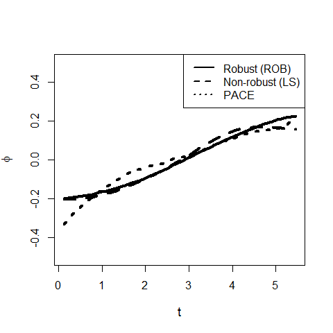

### A prediction experiment

In this section we look at the prediction performance of these FPCA
methods. We will randomly split the data into a training set (80% of the
curves) and a test set (remaining 20% of trajectories), and then use the
estimates of the covariance function obtained with the training set to
predict the curves of the held out individuals.

We first re-construct the data:

``` r
data(aids, package='catdata')
X <- vector('list', 2) 
names(X) <- c('x', 'pp')
X$x <- split(aids$cd4, aids$person)
X$pp <- split(aids$time, aids$person)
n <- length(X$x)
shorts <- vector('logical', n)
for(i in 1:n) {
  tmp <- (X$pp[[i]] >= 0)
  X$pp[[i]] <- (X$pp[[i]])[tmp]
  X$x[[i]] <- (X$x[[i]])[tmp]
  if( length(X$pp[[i]]) <= 1 ) shorts[i] <- TRUE
}
X$x <- X$x[!shorts]
X$pp <- X$pp[!shorts]
X.all <- X
```

We now build the test and training sets. Note that we require that the
range of times of the curves in the test set be strictly included in the
range of times for the curves in the training set.

``` r
ok.sample <- FALSE
max.it <- 20000
set.seed(22) 
it <- 1
n <- length(X.all$x)
while( !ok.sample && (it < max.it) ) { 
  it <- it + 1
  X.test <- X <- X.all 
  ii <- sample(n, floor(n*.2))
  X.test$x <- X.all$x[ii] # test set
  X.test$pp <- X.all$pp[ii] # test set
  X.test$trt <- X.all$trt[ii] # test set
  X$x <- X.all$x[ -ii ] # training set
  X$pp <- X.all$pp[ -ii ] # training set
  X$trt <- X.all$trt[ -ii ]
  empty.test <- (sapply(X.test$x, length) == 0)
  empty.tr <- (sapply(X$x, length) == 0)
  X$pp <- X$pp[!empty.tr]
  X$x <- X$x[!empty.tr]
  X.test$x <- X.test$x[ !empty.test ]
  X.test$pp <- X.test$pp[ !empty.test ]
  ra.tr <- range(unlist(X$pp))
  ra.te <- range(unlist(X.test$pp))
  ok.sample <- ( (ra.tr[1] < ra.te[1]) && (ra.te[2] < ra.tr[2]) )
}
if(!ok.sample) stop('Did not find good split')
```

Now we calculate the three estimators on the training set, using the
same settings as before (except for the bandwidth used to estimate the
mean function, which is set to 0.3).

``` r
ncpus <- 4
seed <- 123
rho.param <- 1e-3 
max.kappa <- 1e3
ncov <- 50
k.cv <- 10
k <- 5
s <- k
hs.cov <- seq(1, 7, length=10)
hs.mu <- .3
ours.r.tr <- efpca(X=X, ncpus=ncpus, hs.mu=hs.mu, hs.cov=hs.cov, rho.param=rho.param, alpha=0.2,
                k = k, s = k, trace=FALSE, seed=seed, k.cv=k.cv, ncov=ncov, max.kappa=max.kappa)
ours.ls.tr <- lsfpca(X=X, ncpus=ncpus, hs.mu=hs.mu, hs.cov=hs.cov, rho.param=rho.param, 
                  k = k, s = k, trace=FALSE, seed=seed, k.cv=k.cv, ncov=ncov, max.kappa=max.kappa)
myop <- list(error=FALSE, methodXi='CE', dataType='Sparse', 
             userBwCov = 1.5, userBwMu= .3,
             kernel='epan', verbose=FALSE, nRegGrid=50)
pace.tr <- FPCA(Ly=X$x, Lt=X$pp, optns=myop)
```

Next, using these estimated mean and covariance functions we construct
predicted curves for the patients in the test set:

``` r
# pr2.pace <- predict(pace.tr, newLy = X.test$x, newLt=X.test$pp, K = ncol(pace.tr$xiEst), xiMethod='CE')
# pp.pace <- pace.tr$phi %*% t(pr2.pace) 
pr2.pace <- predict(pace.tr, newLy = X.test$x, newLt=X.test$pp, K = ncol(pace.tr$xiEst), xiMethod='CE')
pp.pace <- pace.tr$phi %*% t(pr2.pace$scores) 

tts <- unlist(X$pp)
mus <- unlist(ours.ls.tr$muh)
mu.fn <- approxfun(x=tts, y=mus)
mu.fn.ls <- mu.fn(ours.ls.tr$tt)
kk <- 2
pred.test.ls <- pred.cv.whole(X=X, muh=mu.fn.ls, X.pred=X.test,
                        muh.pred=ours.ls$muh[ii],
                        cov.fun=ours.ls.tr$cov.fun, tt=ours.ls.tr$tt, 
                        k=kk, s=kk, rho=ours.ls.tr$rho.param)

tts <- unlist(X$pp)
mus <- unlist(ours.r.tr$muh)
mu.fn <- approxfun(x=tts, y=mus)
mu.fn.r <- mu.fn(ours.r.tr$tt)

pred.test.r <- pred.cv.whole(X=X, muh=mu.fn.r, X.pred=X.test,
                       muh.pred=ours.r$muh[ii],
                       cov.fun=ours.r.tr$cov.fun, tt=ours.r.tr$tt, 
                       k=kk, s=kk, rho=ours.r.tr$rho.param)
```

We now show 4 trajectories in the test set, along with the corresponding
estimated curves:

``` r
xmi <- min( tmp <- unlist(X$x) )
xma <- max( tmp )
ymi <- min( tmp <- unlist(X$pp) )
yma <- max( tmp ) 
ii2 <- 1:length(X$x)
show.these <- c(4, 44, 46, 34)
for(j in show.these) {
  plot(seq(ymi, yma, length=5), seq(xmi, xma,length=5), type='n', xlab='t', ylab='X(t)')
  lines(X.test$pp[[j]], X.test$x[[j]], col='gray50', lwd=5, type='b', pch=19, cex=2)
  lines(pace.tr$workGrid, pp.pace[,j] + pace.tr$mu, lwd=3, lty=3) 
  lines(ours.ls.tr$tt, pred.test.ls[[j]], lwd=3, lty=2)
  lines(ours.r.tr$tt, pred.test.r[[j]], lwd=3, lty=1)
  legend('topright', legend=c('Robust (ROB)', 'Non-robust (LS)', 'PACE'), lwd=2, lty=1:3)
}
```

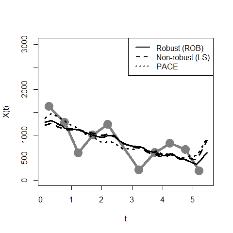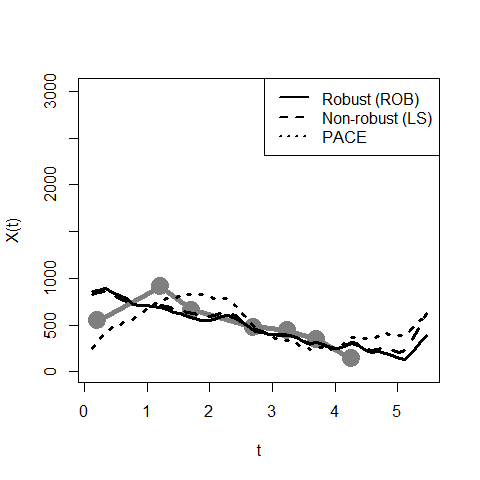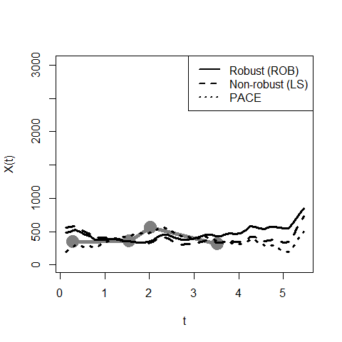

### Technical specs of the above analysis

``` r
version
```

    ##                _                           
    ## platform       x86_64-w64-mingw32          
    ## arch           x86_64                      
    ## os             mingw32                     
    ## system         x86_64, mingw32             
    ## status                                     
    ## major          3                           
    ## minor          6.3                         
    ## year           2020                        
    ## month          02                          
    ## day            29                          
    ## svn rev        77875                       
    ## language       R                           
    ## version.string R version 3.6.3 (2020-02-29)
    ## nickname       Holding the Windsock

``` r
sessionInfo()
```

    ## R version 3.6.3 (2020-02-29)
    ## Platform: x86_64-w64-mingw32/x64 (64-bit)
    ## Running under: Windows 10 x64 (build 18362)
    ## 
    ## Matrix products: default
    ## 
    ## locale:
    ## [1] LC_COLLATE=English_Canada.1252  LC_CTYPE=English_Canada.1252   
    ## [3] LC_MONETARY=English_Canada.1252 LC_NUMERIC=C                   
    ## [5] LC_TIME=English_Canada.1252    
    ## 
    ## attached base packages:
    ## [1] parallel  stats     graphics  grDevices utils     datasets  methods  
    ## [8] base     
    ## 
    ## other attached packages:
    ## [1] fdapace_0.5.5      doParallel_1.0.16  iterators_1.0.13  
    ## [4] foreach_1.5.1      sparseFPCA_0.0.0.1
    ## 
    ## loaded via a namespace (and not attached):
    ##  [1] tidyselect_0.2.5    xfun_0.8            purrr_0.3.2        
    ##  [4] splines_3.6.3       lattice_0.20-38     colorspace_1.4-1   
    ##  [7] vctrs_0.3.4         htmltools_0.5.0     RobStatTM_1.0.3    
    ## [10] yaml_2.2.1          mgcv_1.8-31         base64enc_0.1-3    
    ## [13] pracma_2.2.9        survival_3.1-8      rlang_0.4.8        
    ## [16] pillar_1.4.6        foreign_0.8-75      glue_1.4.2         
    ## [19] RColorBrewer_1.1-2  jpeg_0.1-8.1        lifecycle_0.2.0    
    ## [22] stringr_1.4.0       munsell_0.5.0       gtable_0.3.0       
    ## [25] htmlwidgets_1.5.2   codetools_0.2-16    evaluate_0.14      
    ## [28] latticeExtra_0.6-29 knitr_1.23          htmlTable_1.13.3   
    ## [31] Rcpp_1.0.5          acepack_1.4.1       backports_1.1.10   
    ## [34] checkmate_2.0.0     scales_1.1.1        Hmisc_4.4-0        
    ## [37] gridExtra_2.3       ggplot2_3.3.2       png_0.1-7          
    ## [40] digest_0.6.27       stringi_1.4.6       dplyr_0.8.3        
    ## [43] numDeriv_2016.8-1.1 grid_3.6.3          tools_3.6.3        
    ## [46] magrittr_1.5        tibble_3.0.4        Formula_1.2-3      
    ## [49] cluster_2.1.0       crayon_1.3.4        pkgconfig_2.0.3    
    ## [52] MASS_7.3-51.5       ellipsis_0.3.1      Matrix_1.2-18      
    ## [55] data.table_1.12.6   rstudioapi_0.11     assertthat_0.2.1   
    ## [58] rmarkdown_2.3       R6_2.4.1            rpart_4.1-15       
    ## [61] nnet_7.3-12         nlme_3.1-144        compiler_3.6.3
